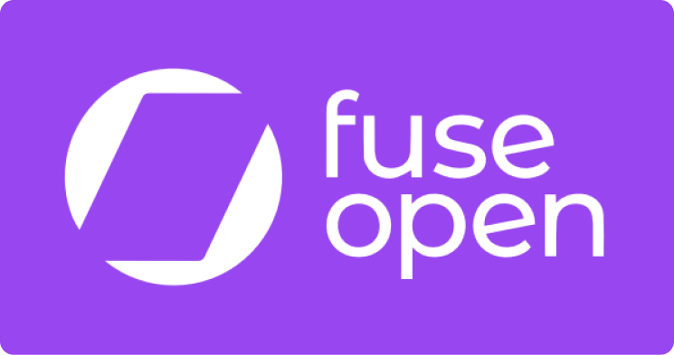

[](https://fuseopen.com)

*Build beautiful, high-performance iOS and Android apps with a single codebase.*

[](https://www.npmjs.com/package/fuse-sdk)
[](LICENSE.txt)
[](https://slackcommunity.fusetools.com/)

## Install

```
npm install fuse-sdk
```

This will install the Fuse SDK. Pass `--save-dev` to install as a dependency in your local project, or `-g` to install
the tooling globally on your system.

Please note that this package contains .NET software that will need [Mono](http://www.mono-project.com/download/)
to run on Linux and macOS.

## Abstract

Fuse SDK is part of the [Fuse Open](https://fuseopen.com) project, an open-source cross-platform mobile app development tool suite, which supports building Android and iOS applications.

With Fuse SDK you can build native mobile user interfaces using the easy to learn UX Markup language and JavaScript/TypeScript to add business logic.

You can also easily integrate with lower level code for the IoT and more, via the powerful and C#-like Uno programming language, where you can easily access native APIs in Java, Objective-C and C/C++. For rapid development, you can even build and test your app directly on your desktop Linux, macOS or Windows computer as well.

## Documentation

Please find our official documentation at [fuseopen.com/docs](https://fuseopen.com/docs).
