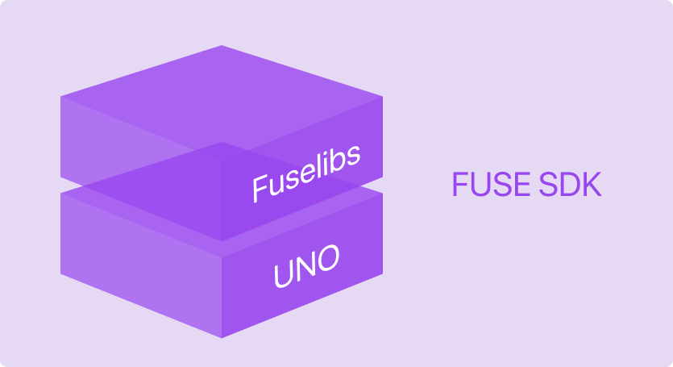

<p align="center"><a href="https://fuseopen.com"></a></p>
<p align="center"><em>Build beautiful, high-performance iOS and Android apps with a single codebase.</em></p>

<p align="center">
<a href="https://ci.appveyor.com/project/mortend/fuse-sdk/branch/master"></a>
<a href="https://www.npmjs.com/package/fuse-sdk"></a>
<a href="https://slackcommunity.fusetools.com/"></a>
<a href="https://opencollective.com/fuse-open"></a>
<a href="LICENSE.txt"></a>
</p>

<p align="center">


</p>

---

<p align="center">
<a href="https://www.npmjs.com/package/fuse-sdk"></a>
<a href="https://www.npmjs.com/package/@fuse-open/fuselibs"></a>
<a href="https://www.npmjs.com/package/@fuse-open/uno"></a>
</p>

---

Fuse SDK is a set of open-source tools and libraries for cross-platform mobile app development.

Build user interfaces using the easy to learn [UX markup language](https://fuseopen.com/docs/ux-markup/ux-markup.html), and add [JavaScript or TypeScript](https://fuseopen.com/docs/fusejs/fusejs.html) for business logic. UX markup is a declarative, XML based language for expressing user interfaces, layout, effects and motion, where animation is a first class citizen, and where you can easily produce advanced visuals and user interfaces.

Access lower level features via the very powerful [Uno programming language](https://fuseopen.com/docs/uno/uno-lang). This is a modern, C#-like language where you can seamlessly access any native API in Java, Objective-C and C/C++, implement new Fuse components, or just write some superfast code. Uno is optimized for performance and portability, compiles down to native C++, and is one of the fastest and most versatile programming languages around. The UI-engine and most run-time features in Fuse are implemented in Uno.

For rapid development, you can even build and test apps directly on your development machine. Fuse apps run on Linux, Mac and Windows, in addition to Android and iOS.

## Install

```shell
npm install fuse-sdk
```

This will install Fuse SDK, including [`uno`](https://github.com/fuse-open/uno) and [a set of libraries](https://github.com/fuse-open/fuselibs) used to build [Fuse](https://fuseopen.com) apps.

## Usage

Please refer to the following links for information about using Fuse SDK.

* A quick introduction to using Fuse SDK can be found in [this blog post](https://medium.com/@mortendanielfornes/introducing-fuse-sdk-890180044c13).

* Check out the [official documentation](https://fuseopen.com/docs), [examples](https://fuseopen.com/examples/) and [source code](https://github.com/fuse-open).

* Come chat with us on [Slack](https://slackcommunity.fusetools.com/).

## Contributors

### Code Contributors

This project exists thanks to all the people who contribute. [[Contribute](CONTRIBUTING.md)]
<a href="https://github.com/fuse-open/fuse-sdk/graphs/contributors"></a>

### Financial Contributors

Become a financial contributor and help us sustain our community. [[Contribute](https://opencollective.com/fuse-open/contribute)]

#### Individuals

<a href="https://opencollective.com/fuse-open"></a>

#### Organizations

Support this project with your organization. Your logo will show up here with a link to your website. [[Contribute](https://opencollective.com/fuse-open/contribute)]

<a href="https://opencollective.com/fuse-open/organization/0/website"></a>
<a href="https://opencollective.com/fuse-open/organization/1/website"></a>
<a href="https://opencollective.com/fuse-open/organization/2/website"></a>
<a href="https://opencollective.com/fuse-open/organization/3/website"></a>
<a href="https://opencollective.com/fuse-open/organization/4/website"></a>
<a href="https://opencollective.com/fuse-open/organization/5/website"></a>
<a href="https://opencollective.com/fuse-open/organization/6/website"></a>
<a href="https://opencollective.com/fuse-open/organization/7/website"></a>
<a href="https://opencollective.com/fuse-open/organization/8/website"></a>
<a href="https://opencollective.com/fuse-open/organization/9/website"></a>
